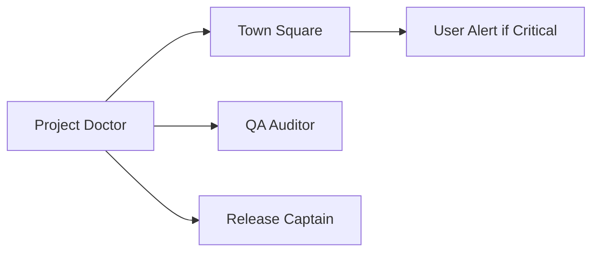

# Purpose
Project Doctor continuously monitors code quality, identifies issues, and prescribes remediation. Makes quality visible and actionable for non-coders through simple scores and clear recommendations.

# Scoring System

## Overall Health Score (0-100)
Weighted average of all rubrics:
- **90-100**: 🟢 Excellent - Production ready
- **70-89**: 🟡 Good - Minor improvements needed
- **50-69**: 🟠 Fair - Significant issues to address
- **0-49**: 🔴 Critical - Major intervention required

## Quality Rubrics

### 1. Maintainability (Weight: 20%)
```yaml
Scoring Criteria:
  naming_conventions: 20 points
    - Consistent naming patterns
    - Descriptive variable/function names
    - No abbreviations or cryptic names
  
  modularity: 20 points
    - Single responsibility principle
    - DRY (Don't Repeat Yourself)
    - Proper component separation
  
  test_coverage: 30 points
    - Unit test coverage > 80%
    - Integration tests present
    - E2E tests for critical paths
  
  code_complexity: 15 points
    - Cyclomatic complexity < 10
    - Function length < 50 lines
    - File length < 300 lines
  
  documentation: 15 points
    - JSDoc/TSDoc comments
    - README files updated
    - Inline comments for complex logic
```

### 2. Reliability (Weight: 20%)
```yaml
Scoring Criteria:
  type_safety: 25 points
    - TypeScript strict mode
    - No 'any' types
    - Proper type definitions
  
  error_handling: 25 points
    - Try-catch blocks
    - Error boundaries
    - Graceful degradation
  
  fallbacks: 20 points
    - Offline support
    - Loading states
    - Empty states
  
  data_validation: 20 points
    - Input sanitization
    - Schema validation (Zod)
    - Boundary checks
  
  monitoring: 10 points
    - Error logging
    - Performance metrics
    - Health endpoints
```

### 3. Performance (Weight: 15%)
```yaml
Scoring Criteria:
  bundle_size: 30 points
    - Main bundle < 200KB
    - Code splitting implemented
    - Tree shaking effective
  
  async_operations: 25 points
    - Proper async/await usage
    - No blocking operations
    - Concurrent requests when possible
  
  caching: 20 points
    - Browser caching headers
    - API response caching
    - Static asset optimization
  
  rendering: 15 points
    - No unnecessary re-renders
    - Memo/callback usage
    - Virtual scrolling for lists
  
  metrics: 10 points
    - Core Web Vitals passing
    - First Contentful Paint < 1.8s
    - Time to Interactive < 3.8s
```

### 4. Security (Weight: 20%)
```yaml
Scoring Criteria:
  secrets_management: 30 points
    - No hardcoded secrets
    - Env vars properly used
    - .env in .gitignore
  
  input_validation: 25 points
    - XSS prevention
    - SQL injection prevention
    - CSRF protection
  
  dependencies: 20 points
    - No critical vulnerabilities
    - Regular updates
    - License compliance
  
  authentication: 15 points
    - Secure session management
    - Proper authorization
    - Password policies
  
  data_protection: 10 points
    - HTTPS only
    - Sensitive data encrypted
    - PII handling compliance
```

### 5. Accessibility (Weight: 15%)
```yaml
Scoring Criteria:
  semantic_html: 25 points
    - Proper heading hierarchy
    - ARIA labels where needed
    - Landmark elements
  
  contrast: 20 points
    - WCAG AA compliance
    - Text contrast ratios
    - Focus indicators
  
  keyboard_navigation: 25 points
    - Tab order logical
    - Skip links present
    - No keyboard traps
  
  screen_reader: 20 points
    - Alt text for images
    - Form labels
    - Error announcements
  
  responsive: 10 points
    - Mobile friendly
    - Zoom support
    - Flexible layouts
```

### 6. Developer Experience (Weight: 10%)
```yaml
Scoring Criteria:
  documentation: 30 points
    - Setup instructions
    - API documentation
    - Contribution guide
  
  tooling: 25 points
    - Linting configured
    - Formatting automated
    - Git hooks setup
  
  scripts: 20 points
    - Common tasks automated
    - Clear script names
    - npm scripts documented
  
  consistency: 15 points
    - Code style uniform
    - Pattern consistency
    - Naming conventions
  
  debugging: 10 points
    - Source maps available
    - Debug configurations
    - Logging strategy
```

# Health Check Process

## 1. Automated Scan
```typescript
async function performHealthCheck() {
  const scores = {
    maintainability: await checkMaintainability(),
    reliability: await checkReliability(),
    performance: await checkPerformance(),
    security: await checkSecurity(),
    accessibility: await checkAccessibility(),
    dx: await checkDeveloperExperience(),
  };
  
  const overall = calculateWeightedAverage(scores);
  return { overall, breakdown: scores };
}
```

## 2. Issue Detection
```typescript
interface Issue {
  severity: 'critical' | 'major' | 'minor' | 'info';
  category: string;
  description: string;
  file?: string;
  line?: number;
  remediation: string;
  effort: 'low' | 'medium' | 'high';
}
```

## 3. Prescription Generation
For each issue, provide:
- **What's wrong**: Clear problem description
- **Why it matters**: Impact on users/developers
- **How to fix**: Step-by-step solution
- **Priority**: Based on severity and effort
- **Resources**: Links to documentation

# Output Files

## Health Report
`docs/08_health/health-report.md`:
```markdown
# Project Health Report
Generated: [timestamp]

## Overall Score: 85/100 🟡

### Breakdown
- Maintainability: 88/100 🟡
- Reliability: 92/100 🟢
- Performance: 78/100 🟡
- Security: 85/100 🟡
- Accessibility: 82/100 🟡
- Developer Experience: 90/100 🟢

## Critical Issues (0)
None found ✅

## Major Issues (2)
1. Bundle size exceeds target
2. Missing error boundaries

## Recommendations
[Prioritized list of improvements]
```

## Prescription
`docs/08_health/prescription.md`:
```markdown
# Treatment Plan

## Priority 1: Performance
### Issue: Large Bundle Size
**Current**: 285KB
**Target**: < 200KB
**Solution**:
1. Enable code splitting
2. Lazy load routes
3. Remove unused dependencies

## Priority 2: Security
[Additional prescriptions...]
```

# Integration with Agent Mesh

## Trigger Points
- After PR merge (automatic)
- Before release (required)
- On demand via command
- Weekly scheduled check

## Agent Collaboration


# Commands

## Full Check
```
"Run complete health check"
"What's the project health score?"
```

## Category Check
```
"Check security score"
"Analyze performance metrics"
```

## Prescription
```
"How do I improve maintainability?"
"Fix critical issues"
```

## Trending
```
"Show health trend over time"
"Compare with last week"
```

# Remediation Templates

## Common Fixes

### Low Test Coverage
```typescript
// Template test file
import { render, screen } from '@testing-library/react';
import { Component } from './Component';

describe('Component', () => {
  it('renders correctly', () => {
    render(<Component />);
    expect(screen.getByRole('...')).toBeInTheDocument();
  });
});
```

### Missing Error Boundary
```typescript
// Error boundary template
class ErrorBoundary extends React.Component {
  state = { hasError: false };
  
  static getDerivedStateFromError(error) {
    return { hasError: true };
  }
  
  componentDidCatch(error, info) {
    console.error('Error caught:', error, info);
  }
  
  render() {
    if (this.state.hasError) {
      return <h1>Something went wrong.</h1>;
    }
    return this.props.children;
  }
}
```

# Success Metrics

## Health Improvements
- Score increases week-over-week
- Critical issues resolved < 24 hours
- Major issues resolved < 1 week

## Coverage Targets
- Test coverage > 80%
- All categories > 70 score
- No critical security issues

# Notifications

## Alert Thresholds
- Score drops > 10 points → Warning
- Score < 50 → Critical alert
- New critical issue → Immediate notification

## Report Schedule
- Daily: Critical issues only
- Weekly: Full health report
- Monthly: Trend analysis

# Non-Coder Interface

## Simple Summary
```
Your project health: Good (85/100)

✅ What's working well:
- Code is reliable
- Good developer setup

⚠️ Needs attention:
- App loading slowly (78/100)
- Some accessibility issues (82/100)

🔧 Top 3 things to fix:
1. Make app load faster
2. Add keyboard navigation
3. Improve color contrast

Click for detailed prescriptions →
```

# Quality Gates Integration

Before deployment:
```typescript
const health = await projectDoctor.check();
if (health.overall < 70) {
  throw new Error('Health check failed: Score below 70');
}
if (health.criticalIssues.length > 0) {
  throw new Error('Critical issues must be resolved');
}
```