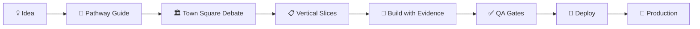

# 🚀 NEW PROJECT PATHWAY

**The AI-Led Development Platform for Non-Coders**  
Build production-ready applications with zero coding through Claude Code's orchestrated agent system.

[](https://github.com/yourusername/new-project-pathway)
[](LICENSE)
[](https://www.microsoft.com/windows)
[](https://nodejs.org)
[](https://claude.ai/code)

## 🎯 What is NEW PROJECT PATHWAY?

A complete development system that transforms ideas into deployed applications through AI orchestration. Whether you're starting fresh or rescuing an existing project, this platform provides:

- **🤖 8 Specialized AI Agents** working together to build your project
- **📝 Clear Action Cues** showing exactly when you need to act
- **🔒 Security-First** approach with automatic guardrails
- **📊 Health Monitoring** to keep your project on track
- **🚢 One-Command Deployment** from idea to production

## 🖥️ System Requirements (Windows)

- **Windows 10/11** (64-bit)
- **Node.js 18+** ([Download](https://nodejs.org/))
- **Git for Windows** ([Download](https://git-scm.com/download/win))
- **Claude Code** ([Get Access](https://claude.ai/code))
- **GitHub CLI** (optional, [Download](https://cli.github.com/))
- **Python 3.11+** (optional, for AI service)

## ⚡ Quick Start (New Project)

### 🎯 SIMPLEST: One-Command Setup (NEW!)
```powershell
# Just run this in any folder:
irm https://raw.githubusercontent.com/yourusername/new-project-pathway/main/init.ps1 | iex

# Or if you have the repo URL:
.\quick-setup.ps1 https://github.com/yourusername/new-project-pathway
```
**That's it!** The script will:
- ✅ Install prerequisites if needed
- ✅ Set up your project
- ✅ Open Claude Code
- ✅ Copy the BUILD PROMPT to clipboard
- ✅ Start the wizard automatically

### 🚀 ALTERNATIVE: Manual Setup
<details>
<summary>Click to see manual steps</summary>

#### 1️⃣ Create Your Project
```powershell
mkdir my-awesome-app
cd my-awesome-app
```

#### 2️⃣ Get NEW PROJECT PATHWAY
```powershell
git clone https://github.com/yourusername/new-project-pathway.git .
Remove-Item -Recurse -Force .git
git init -b main
npm install
```

#### 3️⃣ In Claude Code
1. Open folder: `claude .`
2. Select **"Pathway Guide"** agent
3. Paste **BUILD PROMPT AUTO-START**
4. Answer 3 simple questions
5. Watch it build everything!

</details>

### 🤖 In Claude Code (Auto-Start)
Just paste this:
```
https://github.com/yourusername/your-project
```
Or simply say:
```
start
```

The Pathway Guide will:
1. Ask you 3 simple questions
2. Build everything automatically
3. Show you exactly when to type/click
4. Get you to production in minutes

## 🔧 Rescue an Existing Project

Transform your chaotic codebase into a well-structured application:

### 1️⃣ Add to Existing Project
```powershell
# In your project root
git remote add pathway https://github.com/yourusername/new-project-pathway.git
git fetch pathway
git checkout -b rescue-mission

# Merge the structure (keep your src files)
git checkout pathway/main -- .claude docs scripts .github
git checkout pathway/main -- package.json tsconfig.json

# Install new dependencies
npm install
```

### 2️⃣ Run Project Doctor
```powershell
# Diagnose issues
npm run doctor

# Check environment
npm run env:doctor

# Security audit
npm run security:check
```

### 3️⃣ Fix with Chief Engineer
In Claude Code:
1. Select **"Chief Engineer"** agent
2. Paste **BUILD PROMPT v4.2**
3. Let it restructure your code with evidence-based improvements

## 🤖 The Agent Team

| Agent | Role | When to Use |
|-------|------|-------------|
| **🧙 Pathway Guide** | Project wizard | Starting new projects |
| **🏛️ Town Square** | Coordination hub | Complex decisions |
| **📋 PR Planner** | Work breakdown | Feature planning |
| **✅ QA Auditor** | Quality gates | Before releases |
| **🚢 Release Captain** | Deployment | Shipping to production |
| **📜 Changelog Scribe** | Documentation | Version updates |
| **🏥 Project Doctor** | Health checks | Quality monitoring |
| **👷 Chief Engineer** | Code standards | Fixing problems |

## 📚 Available BUILD PROMPTS

### For Beginners
```powershell
# Interactive wizard with step-by-step guidance
# Use: BUILD PROMPT v2.1
npm run pathway  # Shows instructions
```

### For Quick Projects
```powershell
# Fully automated with clear cues
# Use: BUILD PROMPT v4.1
```

### For Complex Apps
```powershell
# Agent debate for optimal architecture
# Use: BUILD PROMPT v3.0 + v3.1
```

### For Rescue Missions
```powershell
# Evidence-based restructuring
# Use: BUILD PROMPT v4.2
```

## 🛠️ Core Commands

### Development
```powershell
npm run dev              # Start development server
npm run build            # Build for production
npm test                 # Run test suite
npm run typecheck        # Check TypeScript
```

### Health & Security
```powershell
npm run doctor           # Full health check
npm run env:doctor       # Environment validation
npm run security:check   # Security audit
npm run security:compliance  # Compliance validation
```

### Deployment
```powershell
.\scripts\publish.ps1 "message"  # Create PR (PowerShell)
npm run validate:full            # Pre-deploy checks
npm run release                  # Tag release
```

### Agent Tools
```powershell
npm run pathway          # Launch CLI guide
npm run progress:check   # Check build status
```

## 📁 Project Structure

```
my-awesome-app/
├── .claude/             # Agent configurations
│   ├── agents/          # 8 specialized agents
│   └── settings.json    # Claude settings
├── docs/                # Control plane
│   ├── 01_initial/      # Requirements
│   ├── 02_prp/          # Project plan
│   ├── 05_validation/   # Quality gates
│   ├── 07_roadmap/      # Version planning
│   ├── 08_health/       # Health reports
│   ├── 09_security/     # Security docs
│   └── 10_prompts/      # BUILD PROMPTS
├── src/                 # Your application
│   ├── app/             # Next.js pages
│   ├── components/      # React components
│   ├── config/          # Configuration
│   └── utils/           # Utilities
├── scripts/             # Automation
│   ├── publish.ps1      # Windows PR script
│   ├── env-doctor.js    # Environment checker
│   └── pathway-cli.mjs  # Bootstrap CLI
├── services/            # Backend services
│   └── ai-orchestrator/ # AI sidecar (Python)
└── tests/               # Test suites
```

## 🔐 Security Features

- **🚫 Command Denylist**: Blocks dangerous operations
- **🔒 Secret Protection**: Never exposes .env files
- **📊 Dependency Scanning**: Automated vulnerability checks
- **🛡️ PII Safety**: Prevents data leakage
- **✅ Compliance Validation**: Security gates on every build

## 🌟 Key Features

### For Non-Coders
- Clear action cues (📝 🔎 ✅ 🖐️)
- No coding required
- Step-by-step guidance
- Automatic error fixing
- Visual progress tracking

### For Developers
- TypeScript + Next.js 14
- AI-powered development
- Feature flags system
- Automated testing
- CI/CD pipeline

### For Teams
- Consistent structure
- Quality gates
- Security by default
- Documentation automation
- Version management

## 🚦 Progress States

The system tracks progress with evidence:
1. `planned` → Design complete
2. `applied` → Code written
3. `tests-passing` → Tests green
4. `preview-live` → Preview deployed
5. `production-live` → In production

## 🔄 Workflow



## 💻 Windows-Specific Notes

### PowerShell Execution Policy
```powershell
# If scripts are blocked
Set-ExecutionPolicy -ExecutionPolicy RemoteSigned -Scope CurrentUser
```

### Path Separators
The system handles Windows paths automatically. Use forward slashes in:
- Git commands
- npm scripts
- Import statements

Use backslashes in:
- PowerShell commands
- Windows file operations

### Line Endings
```powershell
# Configure Git for Windows
git config --global core.autocrlf true
```

### Terminal Choice
- **Recommended**: Windows Terminal or PowerShell 7+
- **Alternative**: Git Bash
- **Avoid**: Command Prompt (limited features)

## 🆘 Troubleshooting

### "Claude Code not found"
1. Ensure you have access to Claude Code
2. Try: `claude --version`

### "npm command not found"
1. Install Node.js from https://nodejs.org/
2. Restart terminal
3. Verify: `node --version`

### "Scripts blocked"
```powershell
# Allow scripts
Set-ExecutionPolicy RemoteSigned -Scope CurrentUser
```

### Environment Issues
```powershell
# Check what's missing
npm run env:doctor
```

### Project Health Issues
```powershell
# Full diagnosis
npm run doctor
```

## 📈 Success Metrics

After setup, you should see:
- ✅ Health Score: 90+/100
- ✅ Security: 100% compliant
- ✅ Tests: Passing
- ✅ Environment: Minimal (3 vars)
- ✅ Agents: 8/8 operational

## 🤝 Contributing

1. Use Idea Cards template (`docs/11_ideas/`)
2. Follow evidence-based development
3. Maintain minimal environment
4. Keep security guardrails
5. Document with action cues

## 📝 License

MIT - See [LICENSE](LICENSE) file

## 🙏 Credits

Built with:
- [Claude Code](https://claude.ai/code) by Anthropic
- [Next.js](https://nextjs.org/) by Vercel
- [TypeScript](https://www.typescriptlang.org/) by Microsoft

## 🚀 Start Building Now!

```powershell
# Your journey begins with:
npm run pathway
```

**Remember**: Every step shows you exactly what to do with:
- 📝 When to type
- 🔎 When to review
- ✅ What's automated
- 🖐️ What you must do

---

<div align="center">

**NEW PROJECT PATHWAY** - Where ideas become reality without writing code.

[Get Started](https://github.com/yourusername/new-project-pathway) • [Documentation](docs/) • [Report Issues](https://github.com/yourusername/new-project-pathway/issues)

Made with ❤️ for non-coders and developers alike

</div>