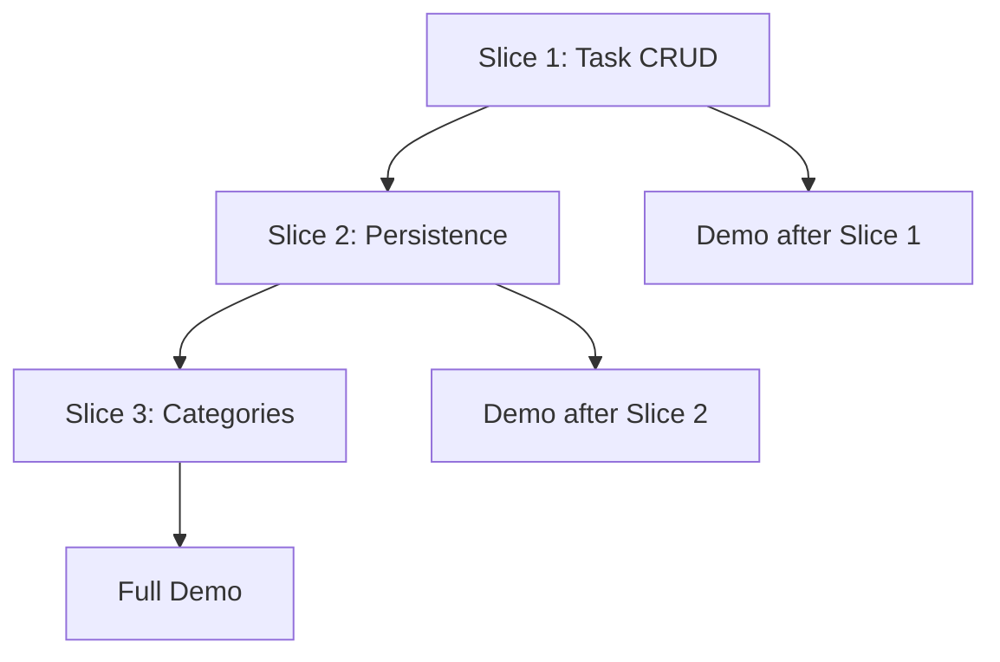

# Example Milestone Plan - Task Management App

## Overview
Breaking down a task management application into 3 vertical slices that can each be built, tested, and deployed independently.

## Slice 1: Task CRUD
**PR Title**: `feat: basic task creation and display`
**Feature Flag**: `taskCrud`
**Timeline**: 2 days
**Size**: ~150 lines

### User Value
Users can create, view, edit, and delete tasks with title and description.

### Demo Script
1. Navigate to homepage
2. Click "New Task" button
3. Fill in title and description
4. Save task and see it in list
5. Edit task title
6. Delete task

### Acceptance Criteria
- [ ] Task form component renders
- [ ] Tasks save to local state
- [ ] Tasks display in list view
- [ ] Edit mode updates task
- [ ] Delete removes task
- [ ] Unit tests pass (>80% coverage)
- [ ] Feature flag toggles UI

### Technical Components
```
src/
├── components/
│   ├── TaskForm.tsx
│   ├── TaskList.tsx
│   └── TaskItem.tsx
├── hooks/
│   └── useTasks.ts
└── types/
    └── task.ts
```

### Rollback Plan
Set `taskCrud = false` in flags to hide all UI components.

---

## Slice 2: Task Persistence
**PR Title**: `feat: persist tasks to local storage`
**Feature Flag**: `taskPersistence`
**Timeline**: 1 day
**Size**: ~100 lines
**Dependencies**: Slice 1

### User Value
Tasks persist between browser sessions, preventing data loss.

### Demo Script
1. Create several tasks
2. Refresh browser
3. Verify tasks still appear
4. Work offline - tasks still save
5. Clear storage to reset

### Acceptance Criteria
- [ ] Tasks save to localStorage on change
- [ ] Tasks load from localStorage on mount
- [ ] Handle storage quota errors
- [ ] Provide clear storage option
- [ ] Migration for data structure changes
- [ ] Tests mock localStorage

### Technical Components
```
src/
├── services/
│   └── storage.ts
├── hooks/
│   └── usePersistedTasks.ts
└── utils/
    └── migrations.ts
```

### Rollback Plan
- Set `taskPersistence = false` to use memory-only storage
- Provide data export before disabling

---

## Slice 3: Task Categories
**PR Title**: `feat: organize tasks with categories`
**Feature Flag**: `taskCategories`
**Timeline**: 2 days
**Size**: ~200 lines
**Dependencies**: Slices 1, 2

### User Value
Users can organize tasks into categories (Work, Personal, Shopping, etc.) with color coding.

### Demo Script
1. Create category "Work" with blue color
2. Create category "Personal" with green color
3. Assign existing task to "Work"
4. Create new task directly in "Personal"
5. Filter view by category
6. Show/hide categories

### Acceptance Criteria
- [ ] Category CRUD operations work
- [ ] Tasks link to single category
- [ ] Category filter in UI
- [ ] Color picker for categories
- [ ] Default "Uncategorized" category
- [ ] Cascade delete (category → tasks)
- [ ] Category count badges
- [ ] Tests cover all operations

### Technical Components
```
src/
├── components/
│   ├── CategoryManager.tsx
│   ├── CategoryFilter.tsx
│   └── CategoryBadge.tsx
├── hooks/
│   └── useCategories.ts
├── types/
│   └── category.ts
└── utils/
    └── categoryColors.ts
```

### Rollback Plan
- Set `taskCategories = false` to hide category UI
- Tasks remain but category field ignored
- No data loss on rollback

---

## Dependency Graph



## Risk Assessment

| Slice | Risk | Mitigation |
|-------|------|------------|
| 1 | State management complexity | Start with local state, add Redux later if needed |
| 2 | Storage quota limits | Implement data cleanup and user warnings |
| 3 | Category-task relationships | Use simple foreign key pattern, migrate if needed |

## Success Metrics

### Per Slice
- PR review < 1 hour
- CI passes first try
- Demo works in preview
- No rollback needed

### Overall
- 3 slices = 5 days total
- Each slice adds user value
- No slice blocks another
- All behind feature flags
- Clean git history

## Next Steps

1. **Start Slice 1**
   ```bash
   git checkout -b feature/task-crud
   npm run dev
   ```

2. **Test Flag Toggle**
   ```typescript
   // src/config/flags.ts
   export const flags = {
     taskCrud: true,  // Toggle this
     taskPersistence: false,
     taskCategories: false,
   };
   ```

3. **Open PR**
   ```bash
   ./scripts/publish.sh "feat: basic task creation and display"
   ```