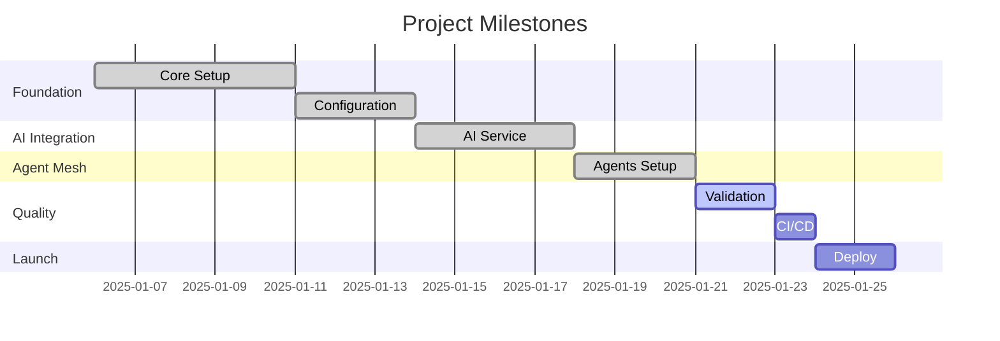

# Milestone Plan

**Project**: NEW PROJECT PATHWAY  
**Generated by**: PR Planner Agent  
**Last Updated**: 2025-01-20

## Overview

This milestone plan breaks down the Project Requirements Plan (PRP) into manageable vertical slices for implementation.

## Milestone Timeline

### Phase 1: Foundation (Weeks 1-2)
- ✅ **M1.1**: Core Next.js setup with TypeScript
- ✅ **M1.2**: Environment configuration and feature flags
- ✅ **M1.3**: Basic project structure and routing

### Phase 2: AI Integration (Weeks 3-4)
- ✅ **M2.1**: AI Orchestrator service setup
- ✅ **M2.2**: POML template integration
- ✅ **M2.3**: API proxy with offline fallback

### Phase 3: Agent Mesh (Weeks 5-6)
- ✅ **M3.1**: Pathway Guide agent
- ✅ **M3.2**: PR Planner agent
- ✅ **M3.3**: Changelog Scribe agent
- ✅ **M3.4**: Town Square coordination
- ✅ **M3.5**: Project Doctor health monitoring

### Phase 4: Quality & Deployment (Week 7)
- 🔄 **M4.1**: Validation gates implementation
- 🔄 **M4.2**: CI/CD pipeline setup
- 🔄 **M4.3**: Documentation finalization

### Phase 5: Launch (Week 8)
- ⏳ **M5.1**: Production deployment
- ⏳ **M5.2**: First project onboarding
- ⏳ **M5.3**: Feedback iteration

## Vertical Slice Details

### Current Slice: M4.1 - Validation Gates
**Duration**: 2 days  
**Dependencies**: Health scoring system  
**Deliverables**:
- Automated test coverage checks
- Security scanning integration
- Performance benchmarks
- Accessibility validation

### Next Slice: M4.2 - CI/CD Pipeline
**Duration**: 1 day  
**Dependencies**: Validation gates  
**Deliverables**:
- GitHub Actions workflow
- Automated deployments
- Preview environments

## Success Criteria

Each milestone must pass:
1. ✅ All tests passing
2. ✅ Code coverage > 80%
3. ✅ No critical security issues
4. ✅ Performance benchmarks met
5. ✅ Documentation complete

## Risk Mitigation

| Risk | Impact | Mitigation |
|------|--------|------------|
| API rate limits | High | Implement caching and offline mode |
| Complex integrations | Medium | Use feature flags for gradual rollout |
| Performance issues | Medium | Early benchmarking and optimization |

## Progress Tracking

## Notes

- All Phase 1-3 milestones completed successfully
- Currently in Phase 4: Quality & Deployment
- On track for Week 8 launch

---

*Managed by PR Planner Agent*  
*Coordinated through Town Square*