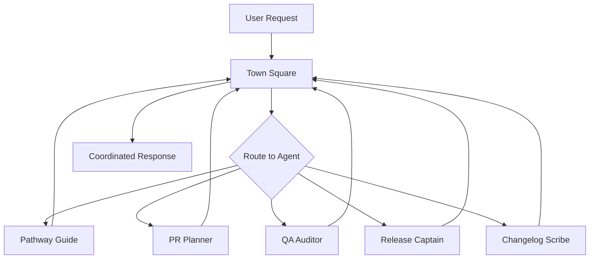

# Coordination Hub - Town Square

This directory contains coordination artifacts, decisions, and handoffs managed by the Town Square agent.

## Purpose

Town Square serves as the central coordination point where all agents:
- Share project context
- Coordinate handoffs
- Resolve conflicts
- Track decisions
- Maintain project status

## Structure

```
07_coordination/
├── README.md           # This file
├── status.md          # Current project status dashboard
├── decisions.md       # Decision log with rationale
├── handoffs.md        # Inter-agent handoff tracking
├── conflicts.md       # Conflict resolution history
└── meetings/          # Meeting notes and planning
    ├── standups/
    └── planning/
```

## How It Works

### Agent Collaboration Flow



### Decision Making Process

1. **Issue Raised**: Any agent or user can raise an issue
2. **Context Gathering**: Town Square collects input from relevant agents
3. **Options Analysis**: Each agent provides their perspective
4. **Decision**: Consensus or escalation to user
5. **Documentation**: Decision and rationale recorded
6. **Implementation**: Coordinated execution

## Active Agents

| Agent | Role | Primary Output |
|-------|------|----------------|
| **Pathway Guide** | Project onboarding | PRP documents |
| **PR Planner** | Slice breakdown | Milestone plans |
| **QA Auditor** | Quality validation | Gate results |
| **Release Captain** | Deployment management | Release status |
| **Changelog Scribe** | Change documentation | Changelogs |
| **Town Square** | Coordination | Decisions & status |

## Coordination Protocols

### 1. New Feature Request
```
User → Pathway Guide → Town Square → PR Planner → Development
```

### 2. Release Coordination
```
Development → QA Auditor → Town Square → Changelog Scribe → Release Captain
```

### 3. Conflict Resolution
```
Agent A ↔ Agent B → Town Square → Resolution → Implementation
```

## Quick Commands

### Check Status
```
"What's the current project status?"
"Show me active work items"
"List blocked tasks"
```

### Coordinate Work
```
"Coordinate the next release"
"Plan the next sprint"
"Schedule agent tasks"
```

### Resolve Issues
```
"Resolve conflict between agents"
"Escalate blocker to user"
"Document decision about X"
```

## Decision Templates

### Technical Decision
```markdown
## [Date]: [Technical Decision Title]
**Agents Consulted**: [list]
**Problem**: [description]
**Options**:
1. [option with pros/cons]
2. [option with pros/cons]
**Decision**: [chosen option]
**Rationale**: [why this option]
**Implementation**: [how to execute]
```

### Process Decision
```markdown
## [Date]: [Process Decision Title]
**Initiated By**: [agent/user]
**Current Process**: [description]
**Proposed Change**: [description]
**Impact**: [who/what affected]
**Decision**: [approved/modified/rejected]
**Rollout Plan**: [how to implement]
```

## Handoff Protocol

### Standard Handoff
```markdown
## [Date]: [Source] → [Destination]
**Deliverable**: [what's being handed off]
**Status**: [current state]
**Context**: [background info]
**Required Actions**: [next steps]
**Success Criteria**: [definition of done]
**Deadline**: [if applicable]
```

## Conflict Resolution

### Resolution Hierarchy
1. **Safety First**: Security and data integrity
2. **User Value**: Meeting user requirements
3. **Technical Excellence**: Code quality and maintainability
4. **Efficiency**: Time and resource optimization

### Escalation Path
1. Agent-to-agent negotiation
2. Town Square mediation
3. User decision required

## Status Dashboard

The `status.md` file maintains:
- Current sprint/milestone
- Active work items per agent
- Blockers and dependencies
- Recent completions
- Upcoming milestones

## Best Practices

1. **Document Everything**: All decisions must have written rationale
2. **Consult Affected Agents**: No surprises
3. **User-Centric**: Decisions serve user goals
4. **Reversible**: Prefer reversible decisions
5. **Timely**: Don't let decisions block progress

## Emergency Procedures

### All-Stop
Immediately halt all agent activities:
```
"EMERGENCY STOP ALL AGENTS"
```

### Status Recovery
Rebuild project state after error:
```
"Recover project status"
```

### Rollback Coordination
Coordinate system-wide rollback:
```
"Coordinate emergency rollback"
```

## Integration with CI/CD

Town Square coordinates with:
- GitHub Actions (via Release Captain)
- Vercel Deployments (via Release Captain)
- Test Suites (via QA Auditor)
- Documentation (via Changelog Scribe)

## Metrics Tracked

- Decision turnaround time
- Handoff success rate
- Conflict frequency
- Agent utilization
- Blocker resolution time

## Contact

The Town Square agent is always available in Claude Code to coordinate multi-agent workflows and resolve complex project decisions.