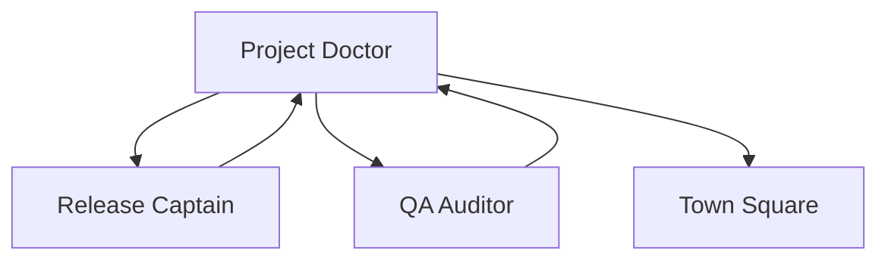

# Project Health Monitoring

This directory contains health reports, prescriptions, and quality metrics managed by the Project Doctor agent.

## Purpose

Project Doctor provides automated quality assessment with actionable remediation guidance, making quality visible and achievable for non-coders through simple scores and clear recommendations.

## Structure

```
08_health/
├── README.md           # This file
├── health-report.md    # Latest health assessment
├── prescription.md     # Actionable fixes with code
├── history/           # Historical reports
│   └── YYYY-MM-DD.md  # Daily snapshots
└── metrics/           # Detailed metric breakdowns
    ├── maintainability.md
    ├── reliability.md
    ├── performance.md
    ├── security.md
    ├── accessibility.md
    └── dx.md
```

## Health Score System

### Overall Score (0-100)
- **90-100**: 🟢 Excellent - Production ready
- **70-89**: 🟡 Good - Minor improvements needed  
- **50-69**: 🟠 Fair - Significant issues to address
- **0-49**: 🔴 Critical - Major intervention required

### Categories & Weights
| Category | Weight | Focus |
|----------|--------|-------|
| Maintainability | 20% | Code quality, tests, docs |
| Reliability | 20% | Error handling, type safety |
| Performance | 15% | Speed, bundle size, metrics |
| Security | 20% | Vulnerabilities, secrets |
| Accessibility | 15% | WCAG compliance, usability |
| Developer Experience | 10% | Tooling, automation |

## Quick Commands

### Run Health Check
```bash
npm run health:check
```

### Generate Report
```bash
npm run health:report
```

### Check Specific Category
```bash
npm run health:check --category=security
```

### View Prescriptions
```bash
npm run health:prescribe
```

## Integration Points

### CI/CD Pipeline
Health checks run automatically:
- On every PR (blocking if < 70)
- Before production deploy (blocking if < 80)
- Daily scheduled checks

### Git Hooks
Pre-commit checks for:
- No new critical issues
- Score doesn't drop > 5 points

### Agent Collaboration


## Report Sections

### Health Report (`health-report.md`)
- Overall score with emoji status
- Category breakdown with scores
- Issue list by severity
- Trend analysis
- Quick wins available
- What's working well

### Prescription (`prescription.md`)
- Prioritized fix list
- Step-by-step solutions
- Code examples
- Expected impact
- Time estimates
- Resources & documentation

## Automation

### Scheduled Checks
```typescript
// Daily at 9 AM
schedule.daily(() => {
  const health = await runHealthCheck();
  await generateReport(health);
  if (health.overall < 70) {
    await alertTeam(health);
  }
});
```

### Threshold Alerts
- Score < 50: Critical alert to team
- Score drops > 10: Warning notification
- New critical issue: Immediate alert

## Quality Gates

### PR Merge Requirements
```yaml
health_check:
  minimum_score: 70
  no_critical_issues: true
  no_major_regressions: true
```

### Deploy Requirements
```yaml
production_deploy:
  minimum_score: 80
  all_categories_above: 60
  security_score_above: 85
```

## Metrics Tracked

### Code Quality
- Test coverage percentage
- Cyclomatic complexity
- Code duplication
- Documentation coverage

### Performance
- Bundle size (KB)
- Load time (seconds)
- Core Web Vitals
- API response times

### Security
- Vulnerability count
- Dependency audit
- Secret scanning
- OWASP compliance

### Accessibility
- WCAG violations
- Keyboard navigation
- Screen reader support
- Color contrast ratios

## Best Practices

1. **Run checks frequently** - Don't wait for CI
2. **Fix issues early** - Easier when fresh
3. **Focus on trends** - Not just absolute scores
4. **Celebrate improvements** - Even small ones
5. **Use prescriptions** - They have copy-paste fixes

## Troubleshooting

### Score Unexpectedly Low
- Check for new dependencies
- Review recent code changes
- Look for configuration changes
- Verify test coverage accurate

### Prescription Not Working
- Ensure dependencies updated
- Check for conflicting configurations
- Try clean install
- Ask Project Doctor for alternatives

## Non-Coder Guide

### Understanding Your Score
```
87/100 🟡 = Good health!

Think of it like a report card:
- 90+ = A (Excellent)
- 80-89 = B (Good) 
- 70-79 = C (Okay)
- Below 70 = Needs work
```

### What to Focus On
1. **Red items** - Fix immediately
2. **Orange items** - Fix this week
3. **Yellow items** - Fix when convenient
4. **Green items** - You're doing great!

### Getting Help
Just ask:
- "What's wrong with my project?"
- "How do I fix the security issues?"
- "Make my project healthier"

## Resources

- [Quality Metrics Guide](https://docs.example.com/quality)
- [WCAG Guidelines](https://www.w3.org/WAI/WCAG21/quickref/)
- [Security Best Practices](https://owasp.org/www-project-top-ten/)
- [Performance Budgets](https://web.dev/performance-budgets-101/)

---

*Managed by Project Doctor Agent*  
*Part of the NEW PROJECT PATHWAY system*