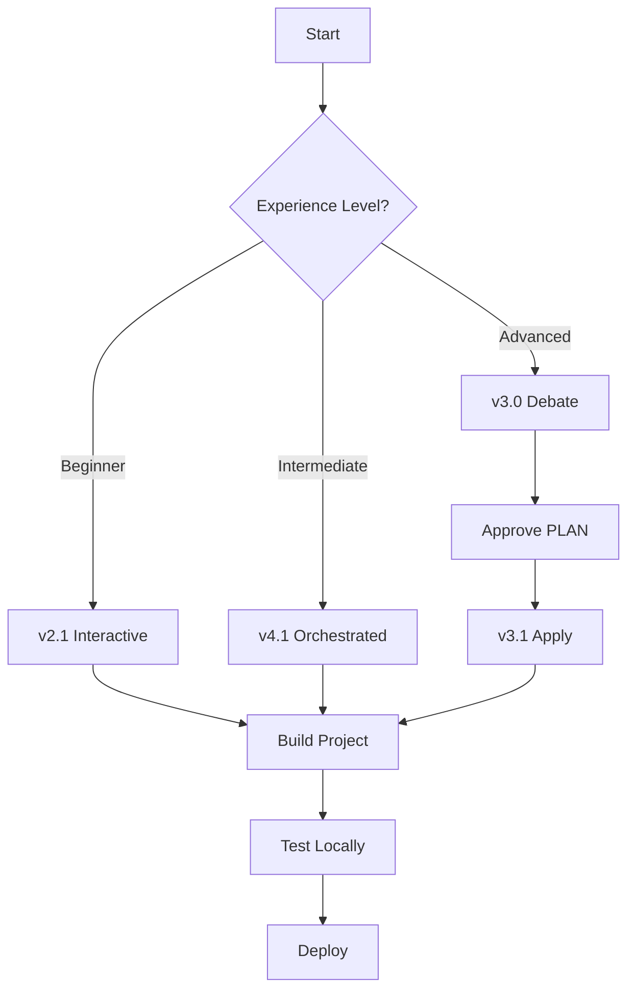

# BUILD PROMPTS Library

## Quick Start

1. **Open Claude Code** with this project folder
2. **Select "Pathway Guide"** agent
3. **Copy and paste** one of the BUILD PROMPTS below

## Available Prompts

### 📘 BUILD PROMPT v2.1 - Interactive Wizard
**Best for**: First-time users, step-by-step guidance

**Features**:
- 📝 Clear questions at each step
- 🔎 Review before building
- ✅ Automated file creation
- 🖐️ Tells you when manual action needed

**Use when**: You want full control and understanding of each step

---

### 📗 BUILD PROMPT v3.0 - Town Square Debate
**Best for**: Optimal architecture decisions

**Features**:
- ✅ Agents debate best approach
- 🔎 Single unified PLAN to approve
- 📝 Minimal input required
- ✅ Consensus-driven design

**Use when**: You want the best technical solution with minimal input

**Companion**: Use v3.1 after approval to apply changes

---

### 📙 BUILD PROMPT v3.1 - Apply & Ship
**Best for**: Executing approved PLANs

**Features**:
- ✅ Applies approved changes
- ✅ Runs all tests
- ✅ Generates changelog
- 🖐️ Helps with PR creation

**Use when**: After v3.0 PLAN approval

---

### 📕 BUILD PROMPT v4.1 - Full Orchestration
**Best for**: Complete automation with clear cues

**Features**:
- ✅ End-to-end automation
- 📝 Clear action cues throughout
- 🔎 Approval points clearly marked
- 🖐️ Manual steps explicitly shown

**Use when**: You want maximum automation with full visibility

## Action Cue Legend

Every prompt uses these cues to show who does what:

| Cue | Meaning | Who Acts |
|-----|---------|----------|
| 📝 | YOUR INPUT NEEDED | You type or provide info |
| 🔎 | REVIEW & APPROVE | You check and confirm |
| ✅ | I WILL DO THIS | Agent handles automatically |
| 🖐️ | MANUAL STEP | You must do this yourself |

## Choosing the Right Prompt

### For Non-Coders
Start with **v2.1** (Interactive Wizard)
- Most guidance
- Explains everything
- Step-by-step approach

### For Quick Projects
Use **v4.1** (Full Orchestration)
- Fastest path to working code
- Clear about what's happening
- Minimal decisions needed

### For Complex Projects
Use **v3.0** + **v3.1** (Debate + Apply)
- Best architectural decisions
- Multiple agents collaborate
- Optimal technical approach

## Usage Flow



## Example Interactions

### v2.1 Example
```
Bot: 📝 YOUR INPUT NEEDED: What's the name of your project?
You: Task Tracker
Bot: ✅ I WILL DO THIS: Creating project structure...
```

### v3.0 Example
```
Pathway Guide: "We need a task tracker for teams"
PR Planner: "I suggest 2 vertical slices..."
QA Auditor: "Add test coverage requirements..."
Bot: 🔎 REVIEW & APPROVE: Consensus reached. Approve?
```

### v4.1 Example
```
Bot: 📝 YOUR INPUT NEEDED: What would you like to build?
You: A blog
Bot: ✅ I WILL DO THIS: [Shows everything being built]
Bot: 🖐️ MANUAL STEP: Run 'npm install'
```

## Tips for Success

1. **Read the action cues** - They tell you exactly when to act
2. **Start simple** - You can always add features later
3. **Trust the process** - Agents know best practices
4. **Ask for help** - Type 'help' anytime
5. **Save your work** - Commit to git regularly

## Getting Help

- Type `help` in any prompt for options
- Check `docs/` folder for documentation
- Run `npm run doctor` for health check
- Run `npm run pathway` for this CLI guide

## Version History

- **v2.1**: Added clear action cues for non-coders
- **v3.0**: Town Square debate for optimal design
- **v3.1**: Release Captain execution
- **v4.1**: Full orchestration with visibility

---

**Ready to start?** Pick a prompt above and paste it into Claude Code!