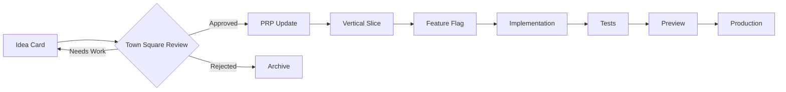

# Idea Cards & Change Requests Template

## Purpose
Ideas and changes land as Idea Cards → PRP deltas → smallest vertical slice with feature flags.
Agents must cite diffs, commands, or logs; no "done/100%" language.

---

## IDEA CARD #[NUMBER]

**Date**: [YYYY-MM-DD]  
**Submitted by**: [User/Agent]  
**Priority**: 🔴 Critical | 🟡 High | 🟢 Normal | ⚪ Low  
**Status**: 📝 Draft | 🔎 Review | ✅ Approved | 🚧 In Progress | ✨ Complete | ❌ Rejected

### Summary
[One sentence describing the idea]

### Problem Statement
📝 **YOUR INPUT NEEDED**: What problem does this solve?
> [Clear description of the current problem]

### Proposed Solution
✅ **I WILL DO THIS**: Technical approach
> [Specific technical implementation]

### Impact Analysis
- **Users affected**: [Who benefits]
- **Code changes**: [Files/components affected]
- **Breaking changes**: Yes/No
- **Feature flag**: `flag_name_here`

### Vertical Slice Definition
```yaml
slice_name: [descriptive-name]
estimated_effort: [hours/days]
dependencies: [list any dependencies]

files_to_create:
  - path/to/new/file.ts
  
files_to_modify:
  - path/to/existing.ts (lines X-Y)
  
tests_required:
  - unit: component.test.ts
  - integration: api.test.ts
```

### Evidence Requirements
Before marking complete, provide:
- [ ] File paths created/modified
- [ ] Test output showing passing
- [ ] Git diff summary (+X -Y lines)
- [ ] Preview URL if applicable
- [ ] Performance metrics if relevant

### PRP Delta
Changes to `docs/02_prp/prp.md`:
```diff
+ New requirement: [description]
+ Acceptance criteria: [specific criteria]
```

### Risk Assessment
| Risk | Likelihood | Impact | Mitigation |
|------|------------|--------|------------|
| [Risk description] | Low/Med/High | Low/Med/High | [How to prevent/handle] |

### Rollback Plan
🖐️ **MANUAL STEP**: If issues arise
1. Disable feature flag: `flag_name_here = false`
2. Revert PR: `git revert [commit-hash]`
3. Redeploy previous version

### Town Square Review
**Agents consulted**:
- [ ] Pathway Guide - Requirements aligned
- [ ] PR Planner - Slice properly sized
- [ ] QA Auditor - Gates defined
- [ ] Chief Engineer - Evidence provided

**Consensus reached**: [Date]
**Decision**: [Approved/Needs revision/Rejected]

### Implementation Tracking
Status: `planned` → `applied` → `tests-passing` → `preview-live` → `production-live`

#### Current Status: `[status]`
Evidence:
```
[Paste actual command output, test results, or URLs]
```

### Changelog Entry
```markdown
### Added
- [Feature]: [Description] (#[PR-number])
```

---

## CHANGE REQUEST #[NUMBER]

**Date**: [YYYY-MM-DD]  
**Type**: 🐛 Bug Fix | ✨ Enhancement | 🔧 Refactor | 📝 Documentation  
**Urgency**: 🚨 Immediate | ⏰ This Week | 📅 Next Sprint | 🗓️ Backlog

### Current Behavior
What happens now (with evidence):
```
[Error message, screenshot, or description]
```

### Expected Behavior
What should happen:
```
[Clear description of correct behavior]
```

### Root Cause (if known)
✅ **I WILL DO THIS**: Investigate
```
File: path/to/problem.ts
Line: X
Issue: [Technical explanation]
```

### Fix Approach
```typescript
// Before
[current code]

// After
[proposed fix]
```

### Test to Verify
```bash
npm test -- [test-file]
# Expected output: All tests pass
```

### Regression Prevention
- [ ] Unit test added
- [ ] Integration test added
- [ ] E2E test if applicable

---

## Quick Templates

### 🐛 Bug Report
```
BUG: [Component] - [Issue]
Steps to reproduce:
1. 
2. 
3. 
Expected: [what should happen]
Actual: [what happens]
```

### ✨ Feature Request
```
FEATURE: [Name]
As a [user type]
I want [functionality]
So that [benefit]
```

### 🔧 Technical Debt
```
DEBT: [Area]
Current: [problematic code/pattern]
Better: [improved approach]
Impact: [performance/maintainability gain]
```

---

## Processing Pipeline



## Best Practices

1. **Be specific** - No vague descriptions
2. **Include evidence** - Screenshots, logs, metrics
3. **Size appropriately** - Vertical slices < 3 days
4. **Feature flag everything** - Ship dark, enable gradually
5. **Document decisions** - Why, not just what
6. **Test first** - Write tests before implementation
7. **Measure impact** - Before/after metrics

---

*Template version: 1.0.0*  
*Managed by Town Square coordination*